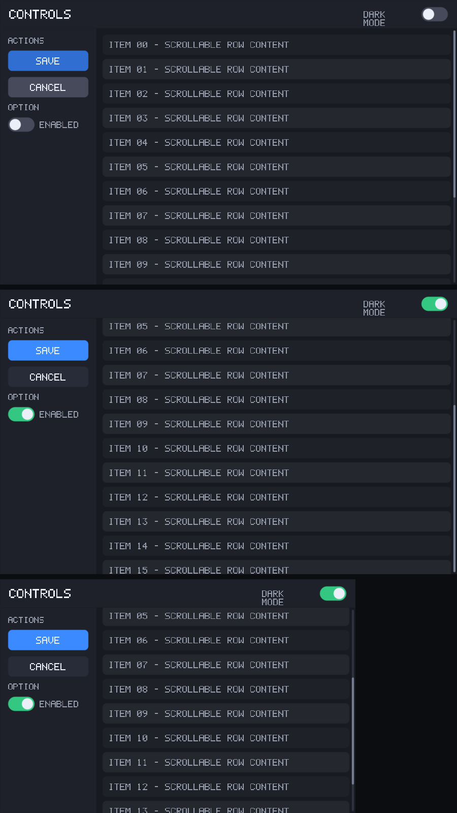

# Primitive Math Rendering Engine

[](https://github.com/Rekonquest/primitive-math-rendering-engine/actions/workflows/ci.yml)

A from-scratch 2D UI rendering engine built **entirely from mathematical primitives** —
no GPU vector library (no Vello, Skia, or Cairo), no web engine, no Tauri/Electron. Shapes
are rasterized from signed-distance fields with analytic anti-aliasing, arbitrary contours
from a scanline path filler, text from a bitmap font, and it composites, lays out, and runs
an interactive widget loop entirely on the CPU.



## The shape of it

Two crates, and only two, per the Composition doctrine:

- **`pmre-kit`** — *the kit*: all the dumb, decision-free mechanism. The eight root atoms
  (`scan · hash · fold · project · scale · compare · combine · order`), geometry + affine
  transforms, SDF coverage + smoothstep anti-aliasing, a scanline path rasterizer (fills and
  strokes), two-stop gradients, alpha-over compositing, a bitmap glyph rasterizer, the reduced
  flex/box layout solver, hit-testing, and clipping. Zero dependencies.
- **`pmre-orchestrator`** — *the orchestrator*: all policy, no mechanism. Painter order, the
  interaction state machine (hover / press / click / toggle / scroll / drag), scrollbars, and
  the resize loop. It drives the kit; it never touches a pixel itself. Zero runtime dependencies.

The pipeline is pure composition all the way to pixels:

```
intent (UxNode, no coordinates)  ─┐
HTML + reduced CSS  ──────────────┼─►  reduced layout (box-model + block/flex)
                                       └─►  drawing primitives (the "math")
                                            └─►  SDF / scanline coverage + alpha-over  ─►  framebuffer
```

Every step maps onto a root atom: `project` transforms points, `compare` is the SDF distance,
`smoothstep` is the anti-aliased coverage, `combine` is Porter-Duff *over*, `order` is the
painter's algorithm.

## Features

- **Shapes** — rect, rounded-rect, circle, line via signed-distance fields with exact AA.
- **Paths** — fill and stroke arbitrary polygons and flattened Béziers (scanline rasterizer,
  nonzero winding so holes and self-overlap work; round joins and caps on strokes).
- **Gradients** — two-stop linear and radial, sampled per pixel.
- **Text** — a built-in bitmap font with word wrapping and clipping.
- **Layout** — a reduced CSS-flexbox/block solver: row/column, `Auto`/`Px`/`Flex` sizing,
  padding, gap, align, justify, borders, radius. Author intent; positions are *derived*.
- **Two front-ends, one core** — a UXI intent tree and an HTML/CSS document reduce onto the
  same box-model + layout + paint core.
- **Interaction** — buttons (hover / press / click), toggles, a scrollable region with clipping,
  a live scrollbar (wheel scroll **and** thumb drag), hit-testing, and auto-resize reflow.
- **Live window** — a winit + softbuffer runner that blits the CPU framebuffer straight to the
  screen with real mouse, wheel, and resize events.

| Paths & holes | Gradients | Strokes |
|---|---|---|
|  |  |  |

## Build & run

```sh
# Static renders
cargo run -p pmre-orchestrator --example demo        # SDF shapes
cargo run -p pmre-orchestrator --example paths       # fills: star, donut (hole), Bézier blob
cargo run -p pmre-orchestrator --example stroke      # strokes: outlined star, polyline, curve
cargo run -p pmre-orchestrator --example gradients   # linear + radial gradients
cargo run -p pmre-orchestrator --example uxi         # a UXI dashboard
cargo run -p pmre-orchestrator --example html        # HTML/CSS reduced to primitives

# Interaction, driven headlessly to image frames
cargo run -p pmre-orchestrator --example ui

# Live interactive window (real mouse / wheel / resize / scrollbar drag)
cargo run -p pmre-orchestrator --example app
```

Each example writes its image to the working directory. Only the `app` example pulls in
dependencies (`winit`, `softbuffer`) for OS windowing and CPU presentation; the library crates
stay dependency-free pure math.

## Tests

```sh
cargo test --workspace        # rasterizer, gradients, stroking, layout coverage
cargo clippy --workspace --all-targets -- -D warnings
```

## License

MIT — see [LICENSE](LICENSE).
